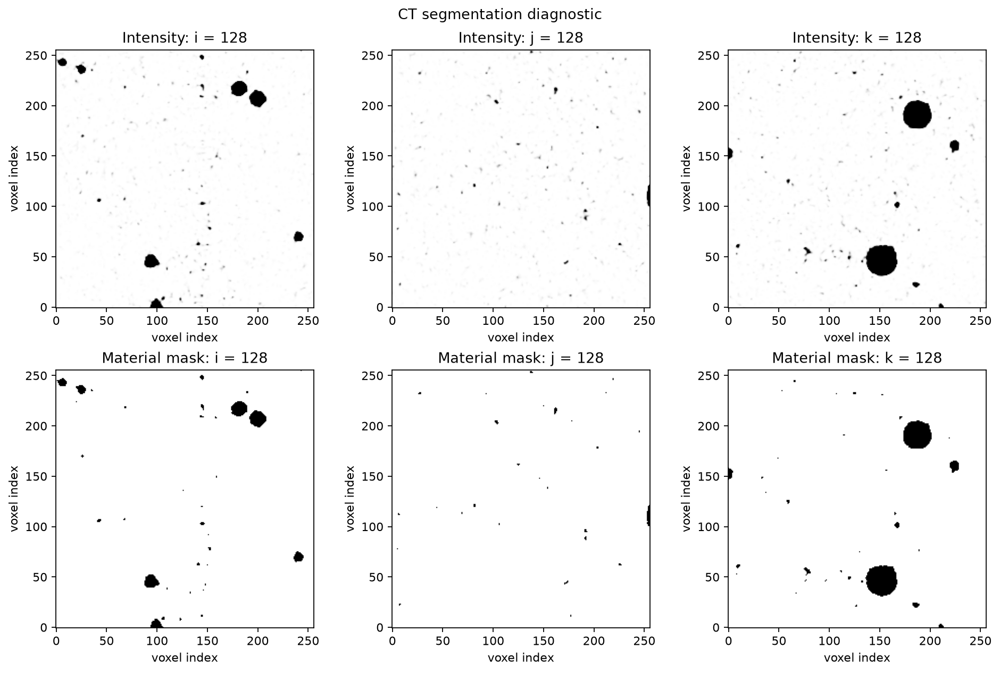
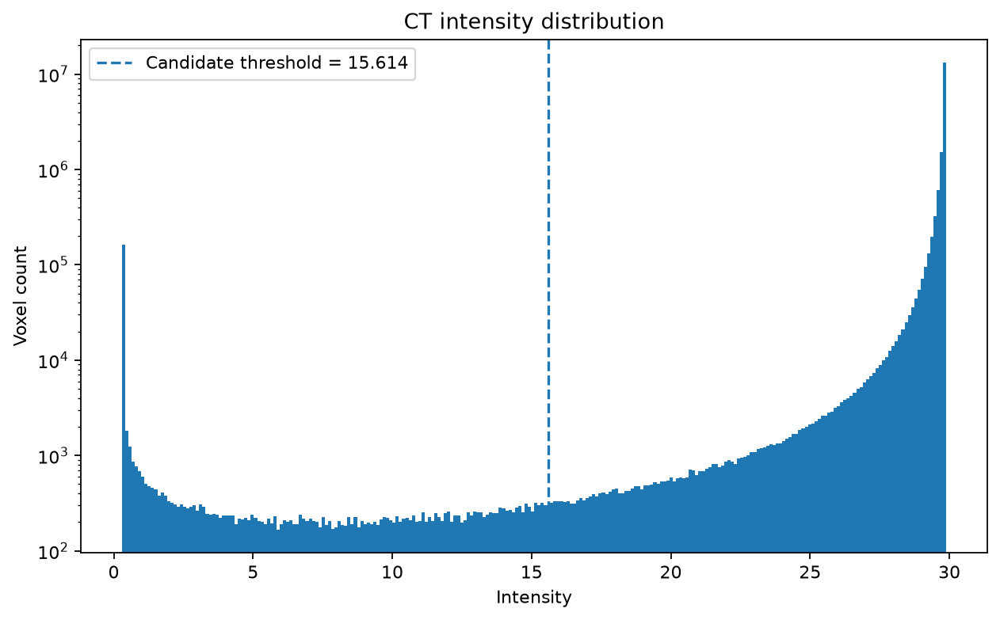
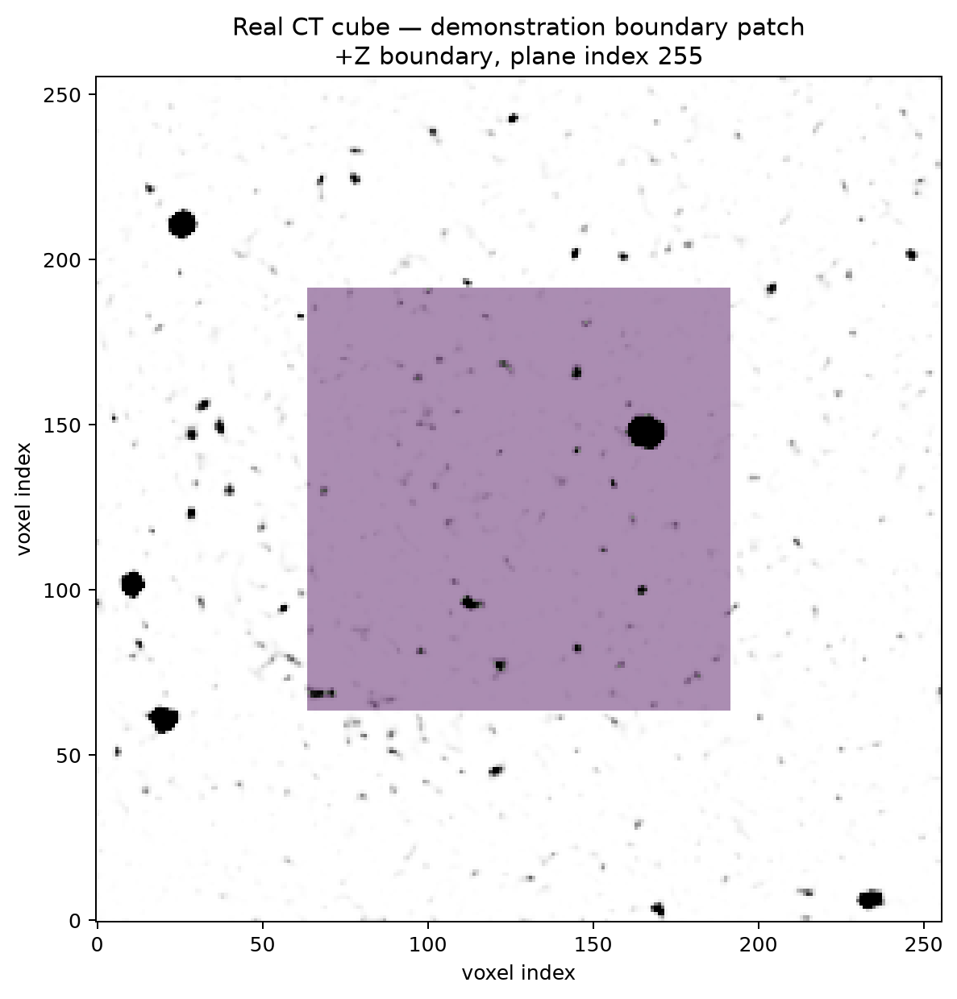
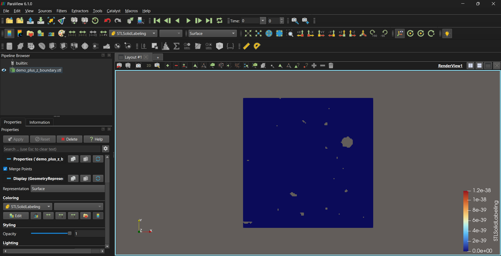

# CT-NIfTI Boundary Pipeline

A reproducible Python workflow for extracting **coordinate-consistent boundary surfaces** from CT-derived NIfTI volumes for engineering simulation workflows.

The repository focuses on the interface between volumetric CT data and simulation-ready boundary geometry:

**NIfTI volume → preprocessing → segmentation → boundary selection → physical-space surface reconstruction → STL + metadata → validation**

## Project Context

This repository is an **independent portfolio reconstruction** inspired by my contribution to the collaborative 12-ECTS Digital Engineering project:

**Development of an Image-to-Analysis Pipeline for the Modeling of Fracture Processes**

at Bauhaus-Universität Weimar, Chair of Data Engineering in Construction.

The original university project covered a broader image-to-analysis workflow, including CT preprocessing and material characterization, boundary-condition preparation, Finite Cell Method (FCM) integration, and phase-field fracture simulation.

This repository does **not** reproduce or claim ownership of the complete university research codebase. It focuses on the CT/NIfTI-to-boundary-surface part related to my contribution and rebuilds the relevant concepts independently in a smaller, testable Python package.

For more detail:

- [Individual contribution summary](docs/contribution_summary.md)
- [Development notes](docs/project_notes.md)
- [Attribution and project context](ATTRIBUTION.md)

## What the Pipeline Does

The implemented workflow can:

- load and inspect CT-derived NIfTI volumes
- inspect voxel spacing, orientation, qform/sform status, and affine information
- crop volumes while preserving physical-coordinate consistency
- reorient volumes to canonical RAS representation
- segment material and void regions
- detect exposed material faces in `+X`, `-X`, `+Y`, `-Y`, `+Z`, and `-Z`
- restrict a boundary to a local fractional ROI
- filter to a directional surface band
- retain the largest connected boundary patch
- convert voxel-face corners into physical coordinates using the NIfTI affine
- triangulate selected voxel faces
- export ASCII STL geometry
- export JSON metadata describing the boundary-selection parameters
- validate triangle count, finite coordinates, degeneracy, and normal consistency

## Workflow

```text
CT-derived NIfTI volume
          |
          v
Volume inspection
          |
          v
Preprocessing
(crop / reorientation)
          |
          v
Material segmentation
          |
          v
Directional exposed-face detection
          |
          v
ROI + surface-band + component selection
          |
          v
Voxel-face corners
          |
          v
Affine transformation to physical coordinates
          |
          v
Triangle generation
          |
          v
STL + JSON metadata
          |
          v
Automated validation
```

## Example Results

### Segmentation diagnostic



The diagnostic compares CT intensity slices with the generated binary material mask.

### Intensity distribution



The real-data diagnostic uses Otsu's method as an automatically estimated segmentation threshold. The threshold is treated as a computational candidate, not as a calibrated physical material property.

### Boundary-patch selection



The overlay shows a selected directional boundary patch on the CT-derived specimen.

### STL output



The selected exposed voxel faces are converted into physical-space triangles and exported as STL geometry.

## Public Reproducible Demo

The repository includes a fully synthetic end-to-end example that does **not** require the original university research dataset.

After installation, run:

```bash
python examples/07_full_synthetic_pipeline.py
```

The script generates its own NIfTI specimen with known spacing, units, origin, qform, and sform, and then performs:

```text
synthetic NIfTI generation
        ↓
material segmentation
        ↓
+Z boundary selection
        ↓
physical-space triangulation
        ↓
geometry validation
        ↓
STL export
        ↓
JSON metadata export
        ↓
diagnostic figures
```

Generated files are written under:

```text
results/full_synthetic_demo/
```

`results/` is ignored by Git because these outputs are reproducible.

## Local Research-Data Examples

Several examples use a locally available CT-derived cube:

```text
local_data/cube_split_01.nii
```

That research dataset is **not distributed in this repository**.

These local examples are therefore intended for development and validation when the dataset is available:

```bash
python examples/01_inspect_nifti.py
python examples/03_crop_and_reorient.py
python examples/05_segment_real_cube.py
python examples/06_select_real_boundary_patch.py
```

The public synthetic examples remain runnable without that private/local dataset.

## Other Examples

Create the synthetic NIfTI reference volume:

```bash
python examples/02_create_synthetic_volume.py
```

Export its directional boundary surface:

```bash
python examples/04_export_synthetic_boundary.py
```

## Installation

Clone the repository:

```bash
git clone https://github.com/ijazahmadraoof/ct-nifti-boundary-pipeline.git
cd ct-nifti-boundary-pipeline
```

Create a virtual environment:

```bash
python -m venv .venv
```

Activate it on Windows PowerShell:

```powershell
.\.venv\Scripts\Activate.ps1
```

Install the package with development and visualization dependencies:

```bash
python -m pip install -e ".[dev,viz]"
```

## Testing

Run the complete test suite:

```bash
pytest -v
```

The tests cover:

- voxel-to-physical and physical-to-voxel coordinate transformations
- physical volume bounds
- geometry-preserving cropping
- canonical reorientation
- material thresholding
- Otsu threshold estimation
- directional exposed-face detection
- fractional ROI selection
- surface-band filtering
- connected-component filtering
- voxel-face triangulation
- reflected-affine normal handling
- STL writing
- metadata export
- boundary-surface validation

## Repository Structure

```text
ct-nifti-boundary-pipeline/
├── docs/
│   ├── images/
│   │   ├── boundary_overlay.png
│   │   ├── segmentation_histogram.png
│   │   ├── segmentation_slices.png
│   │   └── stl_preview.png
│   ├── contribution_summary.md
│   └── project_notes.md
├── examples/
│   ├── 01_inspect_nifti.py
│   ├── 02_create_synthetic_volume.py
│   ├── 03_crop_and_reorient.py
│   ├── 04_export_synthetic_boundary.py
│   ├── 05_segment_real_cube.py
│   ├── 06_select_real_boundary_patch.py
│   └── 07_full_synthetic_pipeline.py
├── notebooks/
├── results/
├── src/
│   └── ct_pipeline/
│       ├── __init__.py
│       ├── boundary.py
│       ├── coordinates.py
│       ├── io.py
│       ├── metadata.py
│       ├── preprocessing.py
│       ├── segmentation.py
│       ├── selection.py
│       ├── stl_export.py
│       ├── surface.py
│       ├── synthetic.py
│       ├── validation.py
│       └── visualization.py
├── tests/
├── .gitattributes
├── .gitignore
├── ATTRIBUTION.md
├── README.md
├── pyproject.toml
└── requirements.txt
```

## Spatial-Metadata Note

A NIfTI array contains voxel data, but simulation geometry depends on the relationship between voxel indices and physical coordinates.

The pipeline therefore inspects the affine and reports whether it comes from an explicit `sform`, an explicit `qform`, or NiBabel's fallback interpretation.

The locally tested CT cube does not define qform/sform spatial metadata or spatial units. For that file, the repository reports this limitation explicitly. Canonical RAS reorientation provides a consistent working representation, but it does **not** establish an authoritative scanner coordinate system.

The public synthetic reference volume avoids this ambiguity by defining:

- known voxel spacing
- millimetre spatial units
- known physical origin
- explicit qform
- explicit sform

## Original Project vs. Portfolio Reconstruction

### Original university contribution

My original project work focused primarily on the interface between CT-derived image data and simulation-ready inputs, including:

- working with CT/NIfTI preprocessing workflows such as cropping and reorientation
- maintaining consistency between voxel indices and physical coordinates
- developing directional NIfTI-based boundary-surface extraction
- converting exposed voxel faces into STL boundary markers
- supporting metadata/JSON handover
- integrating and validating the workflow within an existing research software environment
- collaborating through Git/GitLab branches and an existing codebase

I did **not** develop the complete research GUI, FCM solver, phase-field formulation, or the entire image-to-analysis codebase.

### Independent portfolio implementation

This repository independently rebuilds the relevant concepts and adds portfolio-specific engineering practices such as:

- synthetic reference-volume generation
- standalone package structure
- canonical reorientation utilities
- Otsu threshold diagnostics
- automated unit tests
- standalone ASCII STL export
- geometry validation
- reproducible public examples
- documentation designed for technical review

## Technologies

- Python
- NumPy
- SciPy
- NiBabel
- Matplotlib
- PyTest
- Git / GitHub
- NIfTI
- STL

## License and Attribution

See [ATTRIBUTION.md](ATTRIBUTION.md) for the relationship between this independent portfolio implementation and the original university research project.

The repository currently does not include a software license granting reuse of the independently written implementation.

## Author

**Ijaz Ahmad Raoof**

M.Sc. Digital Engineering  
Bauhaus-Universität Weimar
